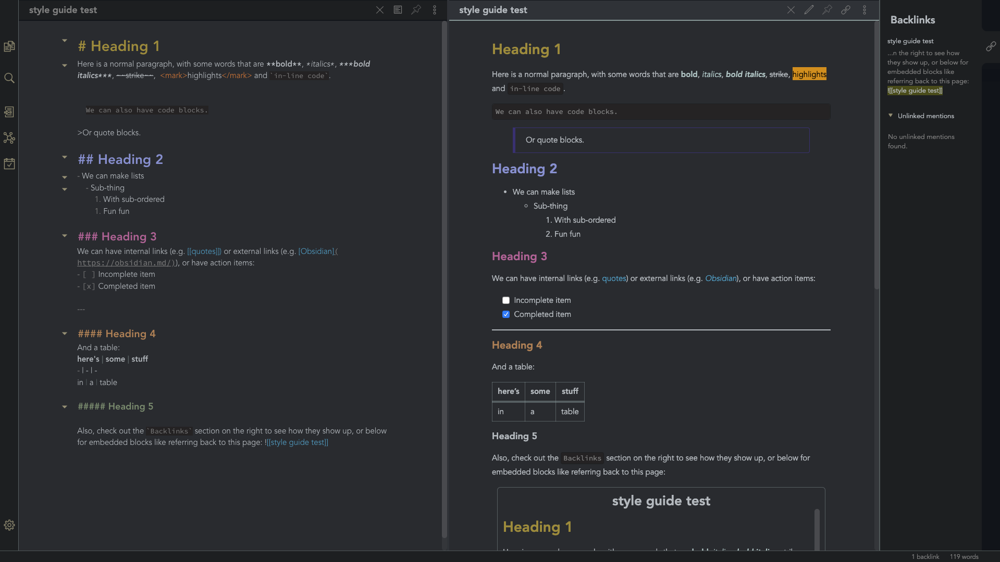

# Comfort Color Dark Theme for Obsidian.md

> A dark theme for [Obsidian](obisidan.md), compatible to Obsidian V0.5.0

## Install

1. Download the obsidian.css file.

2. In Obsidian click Settings->Plugins and turn on "Custom CSS".

3. Put the "obsidian.css" in your vault root folder.

4. Restart Obsidian.

* The font used is Avenir, so make sure you have that downloaded in your font library to achieve the full effect
